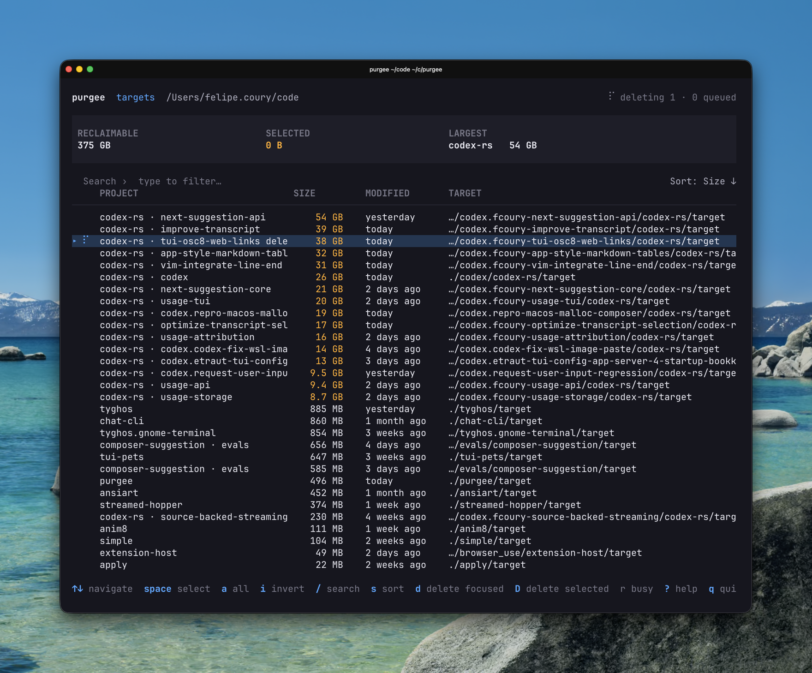

# purgee

`purgee` is a terminal UI for finding disk space used by Rust build artifacts
and removing selected `target/` directories quickly.



## Features

- Recursively discovers Cargo project `target/` directories under a root path.
- Streams measured sizes into the UI while a scan is still running.
- Filters, sorts, and selects entries before deletion.
- Tracks queued, running, completed, and failed deletions inline.
- Provides a `contents` mode for inspecting and cleaning the direct children of
  one directory.

## Install

```sh
cargo install --path .
```

## Usage

Scan recursively for Rust `target/` directories:

```sh
purgee ~/code
# or explicitly
purgee targets ~/code
```

Inspect the direct contents of a single directory:

```sh
purgee contents ./target
```

With no path, `purgee` scans the current directory in `targets` mode.

## Controls

| Key | Action |
| --- | --- |
| `j` / `k`, arrow keys | Move focus |
| `g` / `G` | Jump to first / last row |
| `space` | Toggle focused selection |
| `a` | Toggle all filtered selections |
| `i` | Invert filtered selections |
| `/` | Search |
| `s` | Choose or toggle sort order |
| `d` | Delete focused entry |
| `D` | Delete selected entries |
| `r` | Rescan when idle |
| `?` | Toggle help |
| `q`, `ctrl-c` | Quit |

## Deletion Behavior

In `targets` mode, deletion operates only on discovered `target/` directories
within the scanned root and begins immediately after `d` or `D`.

In `contents` mode, deletion operates only on direct children of the viewed
directory and requires pressing `d` or `D` again to confirm.
